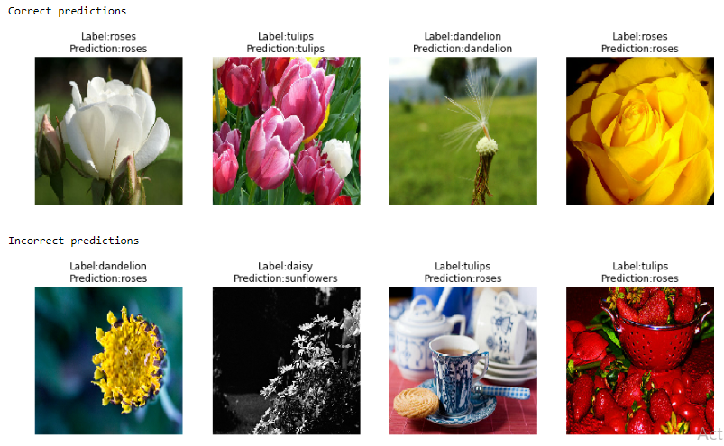

# Transfer learning with TensorFlow
Transfer learning with TensorFlow

Transfer learning using the Inception Resnet V2 model. The model is available at https://github.com/tensorflow/models/tree/master/research/slim to download.

The flowers dataset was used to train and test the model. The dataset is available at http://download.tensorflow.org/example_images/flower_photos.tgz

I experimented with some components that are used for training large datasets in Tensorflow.

- Tensorboard. Its a visualization tool that helps debug the tensorflow model. We can store and create graphs related to metrics we want to show.

- TFRecordDataset class to read from TFRecord files. These files store data in a format optimized to be fast read by tensorflow. Additionally datasets can be chained to form pipelines and preprocess data.

- Tensorflow iterators. They iterate through the datasets to feed the model. In this particular case I used the feedable tensor to maintain the state of the training dataset as
 I want to evaluate the model each x minibatches.

- MonitoredTrainingSession. Manages the training cicle of a model by: 
    -Updating the global step variable
    -Opening and closing the session.
    -Managing hooks and scaffolds.
    -Creating model checkpoints and restarts training from the last checkpoint.
    -Working with other clusters in a distributed environment(this feature was not used).
    
- Hooks. These are classes with functions that are called when at each training step. Tensorflow includes LoogingTensorHook, SummarySaverHook, CheckpointSaverHook.
  Aditionally we can create our custom hooks. For this model I created an EarlyStopping hook to stop training when the validation error hasn't go down after certain
  number of iterations.
  
- Exponential decay. tf.train.exponential_decay is a function that applies exponential decay to the optimizer chosen to train the model.
  Each decay_steps the learning rate is updated by lr = lr*decay_rate
  
I got 94.86% of accuracy in final test set. I also printed some images to see what kind of errors the model made.

 
  

